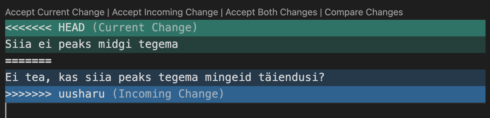

# Õppematerjal
Markdown'i juhend:  
https://www.markdownguide.org/basic-syntax/  
## Git'i materjalid  
### git'i cheat sheet:  
https://gist.github.com/webbj74/3788509  
https://education.github.com/git-cheat-sheet-education.pdf  

**git origin on remote originaal**
**Git HEAD – only one branch can be checked out at a time - and this is what's called the "HEAD" branch. Often, this is also referred to as the "active" or "current" branch.**

- git init
- git status
- git add . või kui spetsiifiline fail siis selle nimi
- git commit -m ""
- git log
- git checkout commit...
- git remote -v
- git branch - näitab kõiki oksi
- git checkout UUSHARU
- git checkout -b UUSHARU
- git merge UUSHARU (pead olema kuskil ja siis sinna liidad UUSHARU)
- git branch -d UUSHARU (-d delete)
- Fetch https://www.atlassian.com/git/tutorials/syncing/git-fetch
- 

Alusta tööd alati pull käsuga, et sikutada remotest vajalik alla.

### Juhend oma arvutist giti tegemiseks
Kõigepealt tee oma arvutis git init.  
Siis git add . , et lisada kõik vajalik.  
Vajadusel ka .gitignore  
Siis git commit -m "siia kommentaar"  

**Siis ühenda github'iga**
- New
- Create
- Push an existing repository...
ja järgi juhiseid

Mergemisega on pisut segane, aga:
Kui soovid kaht oksa ühendada, siis mine sinna, kuhu teise tahad tõmmata ja git merge UUSHARU. Kui on erinevused, siis ta pakub võimaluse ümber kirjutada või asendada teisega emma, kumma või lisada mõlemad:  

Kui mingil põhjusel ei saa, võid katkestada: git merge --abort

Ühtlusta oksad nii lokaalselt kui eemaolevast:
https://www.freecodecamp.org/news/how-to-delete-a-git-branch-both-locally-and-remotely/